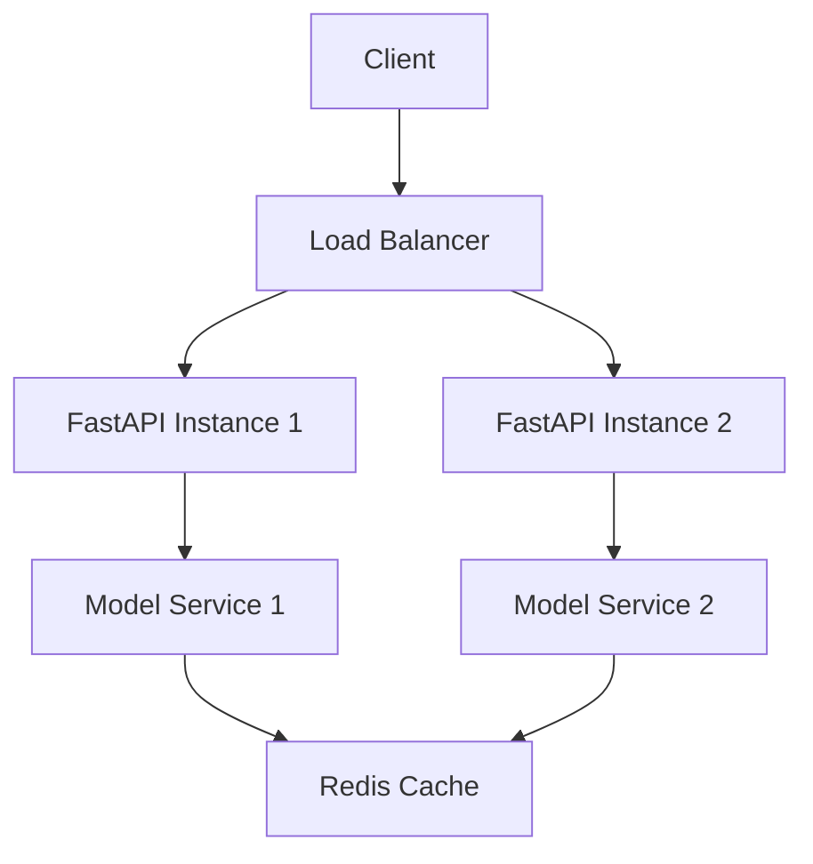

# RecycleX Backend Architecture

## Current Implementation

### Core Components

1. **API Layer (FastAPI)**
   - Health check endpoint (`/health`)
   - Image prediction endpoint (`/predict/image`)
   - Video prediction endpoint (`/predict/video`)
   - Live stream WebSocket endpoint (`/predict/live`)

2. **Model Service**
   - Uses EfficientNetB4 architecture
   - Pre-trained on ImageNet
   - Fine-tuned on TrashNet dataset
   - Handles 6 waste categories
   - Model size: ~75MB (compressed H5)

3. **Image Processing Pipeline**
   - Image resizing (224x224)
   - Color space conversion (BGR to RGB)
   - EfficientNet-specific preprocessing
   - Batch prediction support

### Performance Characteristics

- Input image size: 224x224 pixels
- Model inference time: ~100-200ms per image
- WebSocket latency: ~50-100ms
- Supported formats: JPEG, PNG, MP4

## Recommended Improvements

### 1. Model Optimization

```python
# Model optimization techniques to implement
from tensorflow.lite.python.optimize import optimize_for_size

# Convert to TFLite for faster inference
converter = tf.lite.TFLiteConverter.from_keras_model(model)
converter.optimizations = [tf.lite.Optimize.DEFAULT]
converter.target_spec.supported_types = [tf.float16]
tflite_model = converter.convert()
```

### 2. Enhanced Error Handling

```python
# Add custom error handlers
@app.exception_handler(HTTPException)
async def custom_http_exception_handler(request, exc):
    return JSONResponse(
        status_code=exc.status_code,
        content={
            "error": exc.detail,
            "code": exc.status_code,
            "timestamp": datetime.now().isoformat()
        }
    )
```

### 3. Rate Limiting Implementation

```python
from fastapi import FastAPI
from slowapi import Limiter, _rate_limit_exceeded_handler
from slowapi.errors import RateLimitExceeded

limiter = Limiter(key_func=get_remote_address)
app = FastAPI()
app.state.limiter = limiter
app.add_exception_handler(RateLimitExceeded, _rate_limit_exceeded_handler)

@app.post("/predict/image")
@limiter.limit("10/minute")
async def predict_image(request: Request, file: UploadFile = File(...)):
    # Existing implementation
```

### 4. Request Validation

```python
from pydantic import BaseModel, validator

class PredictionRequest(BaseModel):
    image: UploadFile
    
    @validator('image')
    def validate_image(cls, v):
        if v.content_type not in ["image/jpeg", "image/png"]:
            raise ValueError("Only JPEG and PNG images are supported")
        return v
```

### 5. Caching Layer

```python
from fastapi_cache import FastAPICache
from fastapi_cache.backends.redis import RedisBackend
from fastapi_cache.decorator import cache

@app.post("/predict/image")
@cache(expire=60)
async def predict_image(file: UploadFile = File(...)):
    # Existing implementation
```

## Deployment Architecture



## Scaling Strategy

1. **Horizontal Scaling**
   - Deploy multiple FastAPI instances
   - Use load balancer for traffic distribution
   - Scale based on CPU/Memory metrics

2. **Model Serving**
   - Use TensorFlow Serving for model deployment
   - Implement model versioning
   - Support A/B testing

3. **Caching Strategy**
   - Implement Redis for prediction caching
   - Cache frequent predictions
   - Set appropriate TTL for cached results

## Environment Setup

```bash
# Required packages
fastapi==0.68.0
uvicorn==0.15.0
tensorflow==2.8.0
opencv-python==4.5.3.56
python-multipart==0.0.5
slowapi==0.1.4
fastapi-cache2==0.1.8
redis==4.0.2
```

## Monitoring and Logging

1. **Metrics to Track**
   - Request latency
   - Prediction accuracy
   - Model inference time
   - Memory usage
   - CPU utilization

2. **Logging Implementation**
   - Request/Response logging
   - Error tracking
   - Performance metrics
   - Model version tracking

## Security Measures

1. **API Security**
   - JWT authentication
   - Rate limiting
   - Input validation
   - CORS configuration

2. **Model Security**
   - Model encryption
   - Version control
   - Access logging
   - Regular security audits
